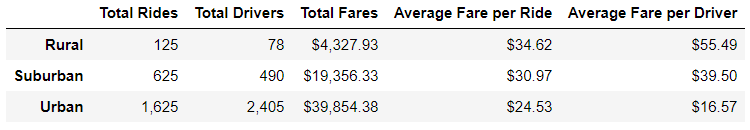
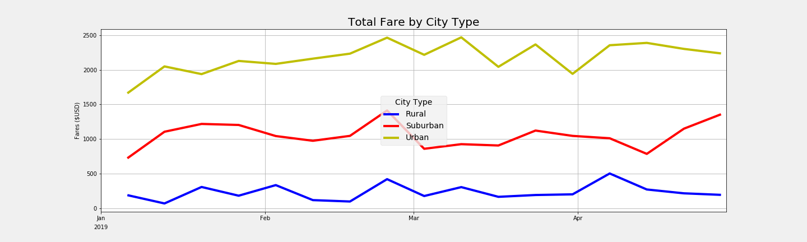

# PyBer_Analysis

## Purpose

This analysis aims to generate the following items:

* A dataframe containing the columns: Total Rides, Total Drivers, Total Fares, Average Fare per Ride, and Average Fare per Driver, for the three types of cities under consideration, namely: Rural, Suburban, and Urban.
* A plot of the Total Fares for each city type for the months of January 2019 though April 2019, inclusive.

### Challenges

The challenges there were encountered were the following:

* The Summary Data Frame displayed correctly in the local environment. However, when the PyBer_analysis.ipynb file was uploaded to github, the display was incorrect. After multiple attempts for remedy the situation, I found out the nbconvert option of the jupyter command. I used the following command to create the PyBer_analysis.html file and uploaded that to the docs folder: 

jupyter nbconvert --to html PyBer_analysis.ipynb

## Summary Data Frame

#### Table 1
<table>
<tr>
<td>

</td>
<td>
*
</td>
</tr>
</table>

###### * Graph was retrieved from <a href="https://selkhayri.github.io/PyBer_Analysis/PyBer_analysis.html">PyBer_analysis.html</a> since the jupyter notebook, <a href="https://github.com/selkhayri/PyBer_Analysis/blob/master/PyBer_analysis.ipynb">PyBer_analysis.ipynb</a>, did not render the Summary Data Frame table correctly on github.

#### Analysis

Table 1 shows that the biggest income, by far, comes from drivers located in urban locales, followed by suburban locales at a distant second. Rural locales, in turn, come in at a distant third. 

#### Conclusion

The numbers show that the growth of the urban areas should be the prime importance.

## Multiple-Line Chart: Graph

#### Graph 1

The plot shows the superimposition of three Total Fare by City Type graphs for urban areas, suburban areas, and for rural areas. 

#### Analysis

The plot shows that the most total fare income, by far, is obtained from drivers in urban locales, followed, at a distant second, by suburban locales, followed, again, at a distant third, by the rural locales.  

#### Conclusion

The plot confirms the findings that were made from the Summary DataFrame table above which conclude that the focus on urban areas should be of prime importance.

## Recommendations

* The main development push should be of the urban locales
* Since the average revenue of the rural locales is so much higher than the other two categories, experimenting with the number of rural drivers to analyze their effect on the average revenue may be warranted to determine the optimum number of rural drivers to maximize revenue from the rural sector.